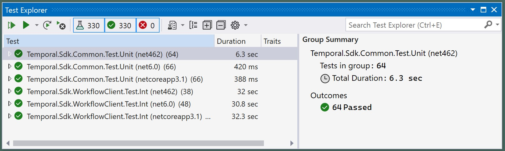

# Contribution Guide

## Please talk to us!

Temporal is built for our users and with our users. We build our software openly, rather than merely _publishing_ it as open source.  
Our code is shared on Github under [`temporalio/sdk-dotnet`](https://github.com/temporalio/sdk-dotnet/). You can learn what we are currently focussed on in the [project item tracker](https://github.com/orgs/temporalio/projects/11/views/4).

Please, reach out to us with questions, requests and suggestions. We also welcome any kind of contributions you can make to the SDK. Of course, anything that is added to our code base, needs to meet the quality and reliability bar we hold ourselves to, and that our users expect from us. We also need to make sure to stay focussed, as anything that is part of the system needs to be supported in the long term.

So, if you would like to make any contribution beyond something really trivial, please touch base with us first. Please use any of these communication channels:

* Participate in our public Slack channel:  
[https://**temporalio**.slack.com/channels/**dotnet-sdk**](https://temporalio.slack.com/channels/dotnet-sdk).

* Submit an issue, a request or a suggestion:  
[https://github.com/**temporalio/sdk-dotnet/issues**](https://github.com/temporalio/sdk-dotnet/issues).


## Contribution Process

* If, after touching base with us (see above), you would like to contribute to our code base, please fork the [`temporalio/sdk-dotnet`](https://github.com/temporalio/sdk-dotnet/)-repo, push your change to your fork, and open a Pull Request for a merge into our `master` brach.

* Please cross-reference your PR with the issue(s) you opened earlier to discuss your change, and please describe in detail what is being changed and why. Please include any additional details that you think are relevant.
Make sure your change is well-tested, that all existing CI-gates are passing, and that you follow our [style guidelines](#style-guidelines).

* If you need more time to work on the PR before it is ready for review, please mark if as _Draft_ in the meantime.

* We try to respond to pull requests quickly. However, if we got heads down on something and overlooked your request, please be lenient with us: we are a small team trying to keep a lot of balls in the air. Reach out to us on Slack (see above) and grab our attention.


## Development Environment

In general, you can build the Temporal SDK for .NET anywhere you can build a .NET app.
We have active contributors using VS Code on Linux and building from the `dotnet` command line. Others use MacOS and JetBrains Rider. All these and other combinations work.  
However, _officially_, we support the following development environment:  
<small>(Here, "_official support_" means that if you are using a different environment, it should still work; but if something does not work quite right, we may not be equipped to actively help you resolving it.)</small>

* Windows 10 or 11.
* Microsoft Visual Studio Professional 2022 (or Enterprise 2022) or later.
* .NET SDK 6.0.200 or later <small>(for compiling/building and running tests on the `net6.0` target)</small>.
* .NET SDK 3.1.419 or later <small>(for running tests on the `netcoreapp3.1` target)</small>.
* .NET Framework 4.6.2 or later <small>(for running tests on the `net462` target)</small>.

You will need to be online during your first build: The build system will not only download packages, but also run scripts that download additional tools.

## Conventions for repo and directory structure

We use a "light-up" multi-repo approach to building.
That means that our main repo is self-sufficient and can be built in isolation, but if you place it into a specific directory structure with other repos, additional features will light up.  
For example, we can automatically pick up the latest gRPC proto definitions for the Temporal service APIs and data contracts, if the build system detects a clone of the respective API repo.

The following instructions refer to the main (aka "upstream") repo (`temporalio/sdk-dotnet`). If you simply want to build the SDK, just clone it on your local machine. However, if you plan to make changes, please fork it and clone your own fork to your local machine instead. We assume the above-mentioned _supported_ [development environment](#development-environment).

The directory structure expected by the build system is configured in the [`\sdk-dotnet\RepoAndBuild-DirectoryStructure.props`](https://github.com/temporalio/sdk-dotnet/blob/master/RepoAndBuild-DirectoryStructure.props) file located in the repo root. That file is the source of truth for the structure described below.

#### Repo Groups

We use the term _Repo Group_ to refer to a set of repos that are related in a sense that they can or must refer to each other during the build process. I.e., they "build together".  
Generally, a repo that does not interact with other repos in that way can be seen as a _Repo Group_ of size 1.

Locally, we organize code by creating a "container" directory (aka "wrapper" directory) for each _Repo Group_. (Nothing do do with Docker, just a directory that _contains_ a _Repo Group_.) The names of such "containers" may be anything, but we find that a short, descriptive name works best.
Within each "container" we clone the necessary repos using the repo name for the respective directory.
For example:

```
C:\Code\
    Tmprl-SDK-DotNet\ 
        sdk-dotnet\
        api\
    NetFx\ 
        runtime\
    TmprlLt\
        temporalite\
    ...
```

Some of the benefits of this approach include:
* You can use different "container" directories to enlist into the same repo (or a fork) many times, keeping an identical internal structure. E.g. 
    ```
    C:\Code\
        Tmprl-SDK-DotNet\           🡸 Clone of my personal fork
            sdk-dotnet\
            api\
        Tmprl-SDK-DotNet-Direct\    🡸 Clone of the upstream repo
            sdk-dotnet\     
        ...
    ```

* It is easier to search files and perform other file operations across the entire _Repo Group_.

* You can place your binary output and other build artifacts OUTSIDE the repo, into a folder that is placed next to the repos' directories within the group "container".  
   - Placing build artifacts outside the repo keeps things clean and concise.  
   - It also makes it easy for the build to use all the repos within the group, while being isolated from other repos.
   - It also helps to avoid the need for searching for the binaries all over the repositories, for cleaning them manually and/or for collecting them in one place later. 

> [!NOTE]
> In this article, when we refer to specific files, we do that relative to the root of the _Repo Group_.

#### Cloning / Enlisting

The `git clone` command must be issued from a "wrapper directory" that has a short, descriptive name for the Repo Group. E.g.:
```
C:\Code>mkdir Tmprl-SDK-DotNet
C:\Code>cd Tmprl-SDK-DotNet
C:\Code\Tmprl-SDK-DotNet>git clone https://github.com/temporalio/sdk-dotnet.git
Cloning into 'sdk-dotnet'...
```

Next, you can optionally clone the repo that contains the _proto_ files that define Temporal's gRPC service APIs and the data contracts used by those APIs ([`temporalio/api`](https://github.com/temporalio/api)). If you place this repo into a Repo Group with the SDK, the build system will use the _protos_ to re-generate the .NET representations for the data contracts and the service stubs. Otherwise, the build system will use the versions included in the SDK repo.

#### Detailed directory structure

The [`\sdk-dotnet\RepoAndBuild-DirectoryStructure.props`](https://github.com/temporalio/sdk-dotnet/blob/master/RepoAndBuild-DirectoryStructure.props)-file modifies the MSBuild properties that point to output directories. This makes sure to collect the binaries for all projects in a single place as follows:  
<small>[Narrow screen scrambles the view below? [View as image](./Resources/Contribution_Guide.Recommended_Repo_Directory_Structure.jpg).]</small>  
```
c:\Code\                        🡸 Root for your code (can be anything you want)
    Tmprl-SDK-DotNet\           🡸 A "container" for your Repo Group
    _build\                     🡸 A shared build output dir for all repos in
        . . .                      the group
    sdk-dotnet\                 🡸 Repo root dir has THE SAME NAME AS THE GIT REPO
        Doc\                    🡸 A dir within the repo (e.g. containing docs)
            . . .
        Src\                    🡸 Another dir within the repo (e.g. the source code)
            . . .                
        . . .                   🡸 . . .
        .gitignore
        LICENSE                 🡸 A file within the repo root dir
        README.md               🡸 . . .
        Directory.Build.props   🡸 The repo-wide build properties
        RepoAndBuild-DirectoryStructure.props  🡸 This dir structure is set here
        . . .
                                                                                                                                       
    api\                        🡸 The root dir for another repo in this group
        . . .
        dependencies\           🡸 Repo files and subdirectories
            . . .
        . . .
        Directory.Build.props   🡸 The repo-wide build properties 
        . . .                      (omitted when MSBuild is not used in the repo)
        RepoAndBuild-DirectoryStructure.props  🡸 This dir structure is set here
        . . .                                     (omitted if MSBuild is not used)
Tmprl-SDK-Java\                 🡸 Some groups have only one repository (mono-repo)
    sdk-java\                   🡸 Mono-repos are the entry in their "containers"
        gradle\
        build\
        . . . 
VueJS\                          🡸 Repos that do not build using this pattern
    vue\                           still get a "container" with a pretty name
        src\
        test\
        . . .
```

##### Mechanism & Details

To create this structure the build system uses two marker files placed in the repo: `.EnlistmentRoot.marker` and `.SrcRoot.marker`:

* **`.EnlistmentRoot.marker`** must be placed into the _root of the repository_.  
It is the top-most folder; typically, it is the folder that contains the "\.git\" subfolder.

* **`.SrcRoot.marker`** must be placed into the _root folder of all code sources in the repository_.  
In general, this "source root" may be the same as the repository root (you may place both files next to each other). The "source root" may also be a subfolder, for example, if the repo root contains other sub-folders unrelated to sources, such as documentation.  
In the _sdk-dotnet_ repo, the "source root" is located in the `sdk-dotnet\Src` sub-folder.  
The `.SrcRoot.marker` and the concept of "source root" are used to automatically place build artifacts: Each artifact will be placed within the _Build Output Root_ using the same relative path, as the artifact's source project's relative path within the folder marked with `.SrcRoot.marker`.


After the binary output redirection, your directory structure will look something like this:  
<small>[Narrow screen scrambles the view below? [View as image](./Resources/Contribution_Guide.Dir_Structure_after_Bin-Placement.jpg).]</small>  
```
c:\Code\                        🡸 Root for your code repos
    Tmprl-SDK-DotNet\           🡸 The "container" for this Repo Group
        _build\                 🡸 Build Output Root for ALL repos in this group
            bin\
                . . .
            obj\
                . . .
                        
        sdk-dotnet\             🡸 The repo root dir has the name of the Git repo
            Doc\                🡸 Repo contents
            Src\                🡸 . . .
            . . .
        api\                    🡸 The repo root dir for another repo in this group
            . . .
            . . .
```    

## Building

You can build the Temporal SDK for .NET from within Visual Studio or from the command line.  

* If you are using Visual Studio, open the main solution file and build the solution (`F6`):  
`\sdk-dotnet\Src\Temporal.Sdk.sln`.

* On the command line, type:  
`dotnet build  sdk-dotnet/Src/Temporal.Sdk.sln`  
<small>(adjust the path for your current directory)</small>

* You can customize your build. E.g.:  
`dotnet build -f <TargetFramework> -c <Configuration> sdk-dotnet/Src/Temporal.Sdk.sln`
  - `<TargetFramework>`: `net6.0`, `netcoreapp3.1` or `net462`.
  - `<Configuration>`: `Debug` or `Release`.

## Building the static API Reference Documentation website

> [!NOTE]
> The API Reference Documentation generator uses tools that only work under Windows.
> If you are using a different OS, please the version hosted at <https://dotnet.temporal.io>.

The solution includes the project located at `\sdk-dotnet\Src\DocGen\DocFxGenerator.csproj`. That project generates the static website containing the API Reference Documentation extracted from sources, and some additional articles. You may be reading this page on the hosted version of that website.

We use [DocFx](https://dotnet.github.io/docfx/) to generate that documentation. 
Compared to building the actual SDK binaries, that process takes a long time, so the documentation site is not generated by default. To turn on the generation of the documentation site, set the MSBuild property `BuildApiRefDocs` to `true` when initiating the build.

An easy way to generate the API Reference Documentation is to execute:  
`\sdk-dotnet\Src\DocGen\BuildApiRefDocs.bat`

The script simply runs the build with the above-named property set. It will automatically download DocFx, generate the documentation, and place it under `\_build\DocFx\dotnet.temporal.io`.


## Running tests

You can run all tests from within Visual Studio or from the command line.

* To run the tests from within Visual Studio, open the Test Explorer (`Ctrl-E, T`) and click on Run all Tests (or `Ctrl-R, V`).  
[](./Resources/Contribution_Guide.VS_Test_Explorer.jpg)

* To run the tests from the command line, execute:  
`dotnet test --results-directory _testresults sdk-dotnet/Src/Temporal.Sdk.sln`   

* You can be more specific about what group of tests you want to run by using one of the `.snl` files in `\sdk-dotnet\Src\Test\`. E.g.:  
`dotnet test --results-directory _testresults/Unit sdk-dotnet/Src/Test/Temporal.Sdk.Test.Unit.Automation.sln`

The SDK contains both, unit and integration tests.  
Integration tests include communicating to a version of Temporal server and validating the resulting behavior or responses. For that, we currently use [our own fork](https://github.com/macrogreg/temporalite/) of [Temporal Lite](https://github.com/DataDog/temporalite). The test harness will download and install Temporal Lite into the Build Output Folder.

## Style guidelines

We use Microsoft's "new" [`.editorconfig`-based style checker](https://www.nuget.org/packages/Microsoft.CodeAnalysis.CSharp.CodeStyle/) to validate and enforce our code styling rules. Our guidelines are documented in the [`\sdk-dotnet\Src\.editorconfig`](https://github.com/temporalio/sdk-dotnet/blob/master/Src/.editorconfig).

The code analyzer is still maturing, and unfortunately it does not yet allow to configure all of our styling rules, as it was possible with some of the legacy tools.

We kindly ask you that you try to notice and follow our coding conventions, even those that are not (yet) supported by the tooling. Of course, we know that is is not always feasible and we will point things out as necessary in a code review. Please be patient with us, we are not trying to be a pain, just filling in where automation lacks.  
(Btw., we will gladly accept a contribution to address the gaps in this space.)

Some of the style rules that are currently not automatically enforced due to missing tooling features include:

* Multi-line string layout:
  ```cs
  SomeApiWithARelativelyLongName.Invocation("Lines should not be too wide; Strings should"
                                          + " start with aligned quotation marks, and plusses"
                                          + " should be on the lower line. Spaces should be on"
                                          + " the lower line. Lorem ipsum dolor sit amet,"
                                          + " consectetur adipiscing elit, sed do eiusmod"
                                          + " tempor incididunt ut labore et dolore magna aliqua.");
  ```

* Parameters should be all on the same line or aligned under each other:
  ```cs
  void SomeMethodWithAnInterestingName(string param, int value, object state)
  {      
  }
  ```
  ```cs
  void AnotherInterestingMethod(string param,
                                int value,
                                object state,
                                CancellationToken cancelToken)
  {        
  }
  ```

* We _do_ use the `...Async` suffix.

* Use named parameters when passing undescriptive literals:
  ```cs
  void DoSomething(int id, string name, SomeType contextData, int checkSum, bool beCool);
  
  // ---

  int checkSum = ...;
  SomeType processingContext = ...;
  DoSomething(id: 42, name: null, processingContext, checkSum, beCool: true);
  ```

* If we pick on something in a code review that is not listed here, let's make sure to add it to this list.
