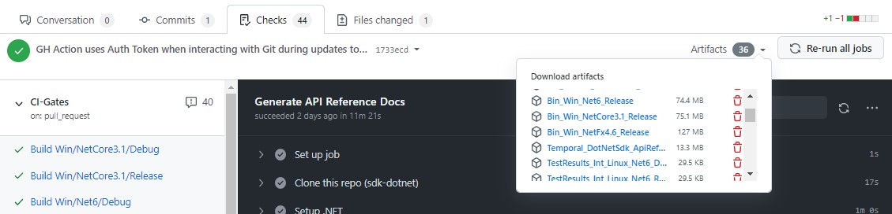

# Using the Temporal SDK for .NET.

## Installation

The SDK is currently [in development](./About_Temporal_SDK_for_DotNet.md#the-sdk-is-currently-under-construction) and we will release [NuGet](https://www.nuget.org/) packages very soon.  At that time we will also publish official releases on our [Github repository](https://github.com/temporalio/sdk-dotnet).  
In the meantime you can install the SDK using one of the following approaches:

* Clone the SDK repo and build the SDK.  
Instructions for building the SDK on your local machine are found in the [Contribution Guide](./Contribution_Guide.md).

* Download a build artifact from a recent commit into the `master` branch.  
To do that:  
  - View the list of Pull Requests recently merged into `master`:  
<small><https://github.com/temporalio/sdk-dotnet/pulls?q=is%3Apr+is%3Aclosed+base%3Amaster></small>
  - Click on a Pull Request from that list.
  - Click on the _Checks_ tab.
  - Click on the _Artifacts_ drop-down.
  - You will see a list of artifacts produced by building the branch after merging the PR you selected.
    - The Artifacts starting with `Bin_` contain the built SDK binaries (most likely, you are looking for these).
    - The Artifacts starting with `TestResults_` contain the results of running tests that are part of our Continuous Integration pipeline. 
    - The `Temporal_DotNetSdk_ApiReference` artifact contains the API Reference Documentation site generated during the build. (You may be reading the hosted version of it right now. If not, it's [here](https://dotnet.temporal.io).)
  - For example:  
  

## Usage

To get started with using the SDK in your app, please see the usage samples:

1. Simple usage scenarios for the **Workflow Client**.  
See [`Part1_SimpleClientUsage.cs`](https://github.com/temporalio/sdk-dotnet/blob/master/Src/Samples/WorkflowClient.UsageSamples/Temporal.Sdk.WorkflowClient.UsageSamples/public/Part1_SimpleClientUsage.cs).  
Demonstrated scenarios:
    * Create workflow client that eagerly validate the connection.
    * Create a workflow client that validates the connection during the initial remote call.
    * Start a new workflow.
    * Access and interact with an existing workflow.
    * Obtain the result of a workflow.
    * Send a signal to a workflow.
    * Query a workflow.
    * Cancel a workflow.
    * Terminate a workflow.  

0. Advanced usage scenarios for the **Workflow Client**.  
See [`Part2_AdvancedClientUsage.cs`](https://github.com/temporalio/sdk-dotnet/blob/master/Src/Samples/WorkflowClient.UsageSamples/Temporal.Sdk.WorkflowClient.UsageSamples/public/Part2_AdvancedClientUsage.cs).  
Demonstrated scenarios:
    * Get detailed information about a workflow; for example, Task Queue Name and Kind.
    * Get the Status of a workflow.
    * Get the Type Name of a workflow.
    * Check whether a workflow with a particular workflow-id exists.
    * Wait for a workflow to conclude without accessing its result.
    * Request a workflow cancellation and wait for the cancellation to occur for a certain amount of time, while interactively displaying progress status. If the workflow does not respect the cancellation request within a particular time, terminate the workflow.
    * Alternative methods for starting a workflow.
    
0. Using the **Workflow Client** to work with individual Workflow Runs (read more about [Workflows, -Chains and -Runs within the Temporal data model](./Workflow_Chains_and_Runs.md)).  
See [`Part3_AddressIndividualRuns.cs`](https://github.com/temporalio/sdk-dotnet/blob/master/Src/Samples/WorkflowClient.UsageSamples/Temporal.Sdk.WorkflowClient.UsageSamples/public/Part3_AddressIndividualRuns.cs).  
Demonstrated scenarios:
    * Obtain a handle for a specific Workflow Run; get the Status of a particular Workflow Run.
    * Obtain the result of a particular Workflow Run, without following the Workflow Chain.
    * Address specific Runs within a Workflow Chain.
    * Interact with Workflow Runs: send Signals, execute Queries, request Cancellation, obtain Description, Terminate, await Conclusion.
    * Obtain immediate results if available, without performing long-running remote calls.
    * Navigate across Workflow Chains, Runs, and back.